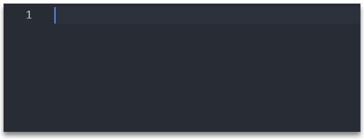
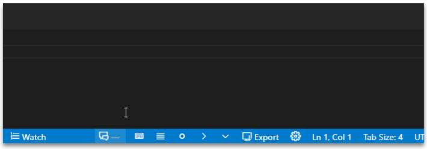

# Disable Key-bindings

!!! setting "`fictionWriter.edit.disableKeybindings`"

Disables the following keybindings added by this extension:
- ++enter++, ++shift+enter++, ++delete++, ++backspace++, ++tab++)

**Note:** If `disabled`, some of the other features, that depend or ar triggered by this keybindings will be disabled (eg. easy Paragraph Creation needs ++enter++ end ++shift+enter++ in order to work properly).

 
# Easy Paragraph Creation

!!! setting "`fictionWriter.edit.easyParagraphCreation`"

To create paragraphs in markdown, you need to add an extra empty line. That, usually, means pressing ++enter++ key twice.

With this setting, you can easily create new paragraphs by hitting one key only (or a combination).

It has two options:

- **Enter**: pressing ++enter++ once will add two line-breaks, and pressing ++shift+enter++ will add one line-break.

    

- **Shift+Enter**: pressing ++enter++ once will add one line-break, but ++shift+enter++ will add two line-breaks.

    

# Writing Dialogues

This is a proposed solution for writing dialogue. In some languages, dialogue is not marked by quotation marks, but is marked only at the beginning a dialogue line.

For example, each line can start with em-dash (—), like so:

!!! quote "The Time Machine, by H. G. Wells"
  
    — You mean to say that that machine has travelled into the future? said Filby.

    — Into the future or the past. I don’t, for certain, know which.

    After an interval the Psychologist had an inspiration. 

    — It must have gone into the past if it has gone anywhere, he said.

Markdown can convert three dashes to em-dash and two dashes to en-dash. However, typing three dash character and one space is not necessarly convenient when writing lots of dialogue lines. 

A widespread practice is to write `-- ` for an `em-dash`, and the text editor will automatically replace it.

## Selecting dialogue punctuation:

??? setting "`fictionWriter.editDialogue.marker`"

    - `"Hello,"` (quotes) **default**
    - `— Hello,` (em-dash followed by one space)
    - `-- Hello`, (two dashes followed by one space)
    - `--- Hello,` (three dashes followed by one space)
    - `—Hello,` (em-dash, no space)
    - `--Hello,` (two dashes, no space)
    - `---Hello,` (three dashes, no space

With this feature, you can controlsthe punctuation used when writing dialogue.

The following options are possible:

- Quotes: _"Hello," John said._ (**default**: this is equivalent with disabling all proposed dialogue features)
- Em-dash followed by one space: _— Hello, John said._
- Two dashes followed by one space:  _`-- `Hello, John said._
- Three dashes followed by one space: _`--- `Hello, John said._
- Em-dash, no space: _—Hello, John said._
- Two dashes, no space: _`--`Hello, John said._
- Three dashes, no space: _`---`Hello, John said._




Once a dialogue marker is selected (other than quotes), the paragraph starting with that marker will be recognized as a dialogue paragraph enabeling other dialogue related features, like text formatting, auto replace, etc.

## Auto-replace dialogue markers

!!! setting "`fictionWriter.editDialogue.markerAutoReplace`"

If enabled, typing `--` followed by a space will insert the selected marker.


Disable this feature if you do not want to auto-replace markers.

## Easily create new dialogue paragraphs

Selecting a dialogue marker (other than quotes) changes the *Easy Paragraph Creation* behaviour as follows:

- if new paragraph is created (either by ++shift+enter++ or by ++enter++), and is from a dialogue paragraph (meaning, the paragraph starts with a marker), then the next paragraph will automatically start with the selected dialogue marker. 

This makes writing alternative dialogue lines much faster.


- when hitting new line, if the only thing on that line is a dialogue marker, is automatically deleted.

- when hitting backspace, and the only thing in front of the cursor is the dialogue marker, the line will be cleared

## Using Dialgoue indents:

Indent for sequential lines of the same dialogue paragraph. (`0` for no indenting)

This is especially useful when using the *one sentence per line* technique. Thus, having sentences from the same dialogue separated by simple line-breaks.

```
-- Hi, said the first dialogue line.
   I am here, on multiple lines.

-- Hi, said the other dialogue line.
   I am also here.

The two lines continued their chat.
```

!!! setting "`fictionWriter.editDialogue.sentenceIndent`"

The indent can be manually set under *Edit Dialouge - Sentence Indent*.

!!! setting "`fictionWriter.editDialogue.sentenceIndentAutoDetect`"

If *Edit Dialogue: Sentence Indent Auto-Detect* is enabled, the indent will be automatically calculated based on the selected dialogue marker, and the previous setting will be ignored.

Example:

```
-- Hi, this is a dialogue.
   It uses two dashes and one space.
   Thus, it has a 3 space indent.

— Hi, this uses em-dash and one space.
  It has just a two space indent.
```